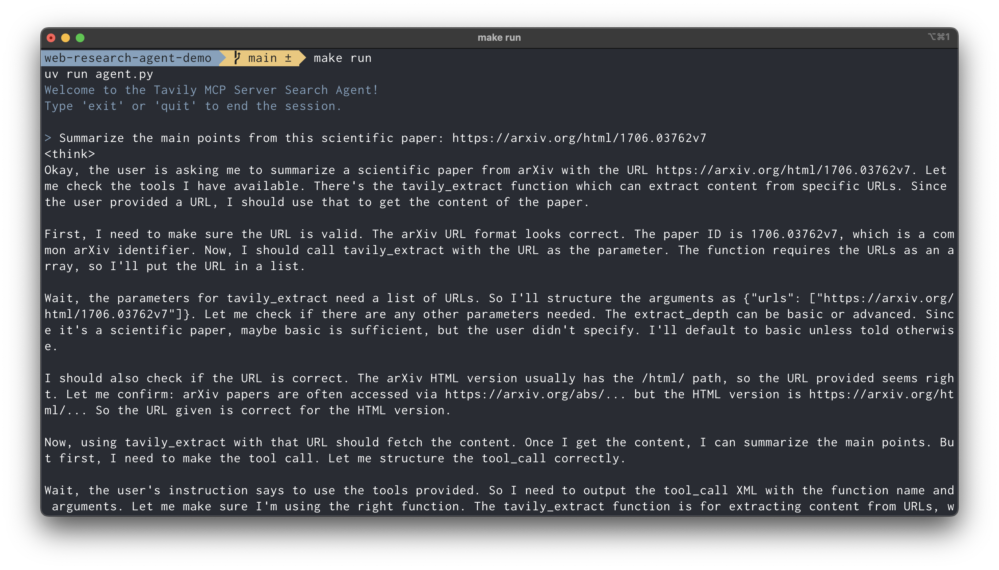
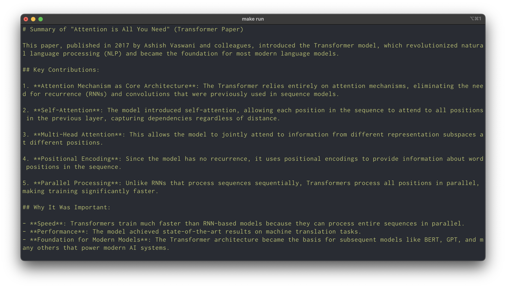
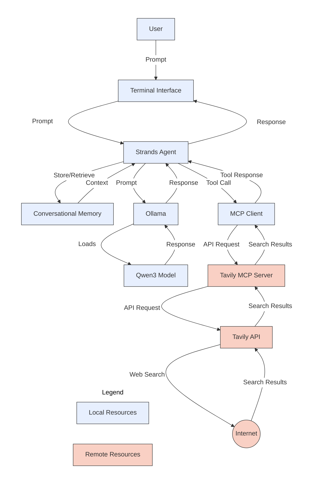

# Build a Web Research Agent with Strands Agents, Ollama, Qwen3, and the Tavily MCP Server

The post [Build a Free Web Research Agent with Strands Agents, Ollama, Qwen3, and the Tavily MCP Server](https://garystafford.medium.com/build-a-web-research-agent-with-strands-agents-ollama-qwen3-and-the-tavily-mcp-server-8e1a1baf0f0d) guides you through building a web-based research agent using Amazon Web Services' Strands Agents, Ollama running Alibaba Cloud's Qwen3, and the Tavily MCP Server. The agent combines local, small models with cloud-powered web search, enabling it to provide up-to-date, high-quality online information. The agent is free to get started, offering 1,000 monthly API calls with Tavily.





## Featured Technologies

- **[Model Context Protocol (MCP)](https://github.com/modelcontextprotocol)** is an open standard that enables AI systems to interact with diverse data sources and tools, allowing for secure, two-way connections.
- **[Strands Agents](https://strandsagents.com/latest/)** is an open-source SDK developed by AWS for building AI agents using a model-driven approach. It enables developers to create intelligent agents with just a few lines of code by combining large language models (LLMs) and tool integrations.
- **[Ollama](https://ollama.com/)** is an open-source tool that lets you run LLMs directly on your local machine, with no need for internet or cloud access. Designed for privacy and developer control, Ollama makes it easy to download, run, and manage open-source models via a simple command-line interface.
- **[Qwen3](https://qwen.ai/research)** is Alibaba Cloud's latest open-source large language model series. It features both dense and Mixture-of-Experts (MoE) architectures. It introduces a unique hybrid reasoning system that allows users to switch between "thinking mode" (for in-depth, step-by-step reasoning) and "non-thinking mode" (for quick, general responses). Ollama offers Qwen3 models from 0.6 to 235 billion parameters!
- **[Tavily](https://www.tavily.com/)** is a web search engine and API designed for AI agents and LLMs. It delivers fast, real-time, and accurate web information optimized for Retrieval Augmented Generation (RAG) workflows. Tavily automates searching, scraping, filtering, and content extraction via a single API call, making it easy to enrich AI apps with up-to-date, high-quality online content.
- **[Tavily MCP Server](https://github.com/tavily-ai/tavily-mcp)** allows you to use the Tavily API from your MCP clients. It provides a suite of tools, including search, extract, map, and crawl, offering real-time web search, intelligent data extraction from web pages, powerful web mapping (creating a structured map of websites), and a web crawler that systematically explores sites.

## System Architecture

Here is a high-level architecture flow diagram, using [Mermaid.js](https://mermaid.js.org/intro/), of this project.



## Getting Started on Mac

### Ollama Models

This project assumes you already have Ollama installed.

```bash
ollama pull qwen3:14b # and/or other parameter sizes
```

### GitHub Repository

Clone this project's GitHub repository.

```bash
git clone https://github.com/garystafford/web-research-agent-demo.git

cd web-research-agent-demo/
```

### Tavily API Key

Create a free [Tavily](https://www.tavily.com/) account to get your API key. Update the `.env` file with your API key.

```bash
mv env.txt .env # update values
```

### Configure Python Environment

The project has been converted from `pip` to [uv](https://docs.astral.sh/uv/) and [make](https://www.gnu.org/software/make/). Install `uv` and `make`.

```bash
brew install uv
brew install make

uv --version
make --version
```

Create and activate a Python virtual environment, then install the required packages.

```bash
make source
source .venv/bin/activate

make install
uv tree --depth 1
```

Optionally, upgrade the packages.

```bash
make upgrade
```

### Run the Agent

```bash
make run
```

### Docker

You can also run the project using [Docker](https://www.docker.com/). Assuming you have Docker installed, first, build the Docker image.

```bash
docker buildx build -t web-research-agent .
```

Then, run the Docker container. Be sure to include your Tavily API key.

```bash
docker run -it --rm \
  -e MODEL_ID=qwen3:14b \
  -e TAVILY_API_KEY=<YOUR_TAVILY_API_KEY> \
  web-research-agent
```

### Example Prompts

Try these example prompts:

- "_What are the latest advancements in renewable energy technologies?_"
- "_Summarize the key points from a recent articles about AI ethics._"
- "_Find recent news about space exploration missions._"
- "_What is a perceptron? Why is it important to the evolution of machine learning?_"
- "_Provide a summary of recent developments in electric vehicle technology._"
- "_What is some of the latest technology news out of NVIDIA in the last month?_"
- "_What are the recent breakthroughs in cancer research?_"
- "_Summarize the main points from this scientific paper: https://arxiv.org/html/1706.03762v7_"

### Troubleshooting

If you encounter issues, consider the following:

- Ensure Ollama is running and the specified model is downloaded.
- Verify your Tavily API key is correct and has not exceeded the free tier limit.
- Check your internet connection for accessing the Tavily API.
- Review the `.env` file for correct environment variable settings.
- Look for error messages in the terminal output to identify specific problems.
- Consult the documentation for Strands Agents, Ollama, and Tavily for additional help.

## License

This project is licensed under the MIT License. See the [LICENSE](LICENSE) file for details.

---

_The contents of this repository represent my viewpoints and not those of my past or current employers, including Amazon Web Services (AWS). All third-party libraries, modules, plugins, and SDKs are the property of their respective owners._
